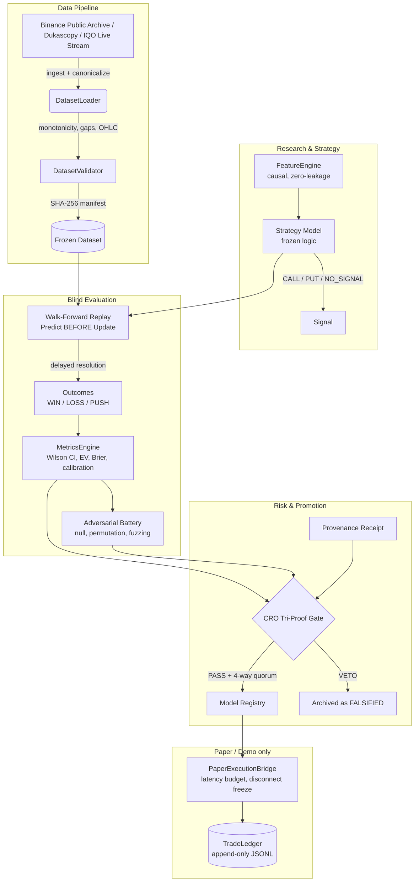
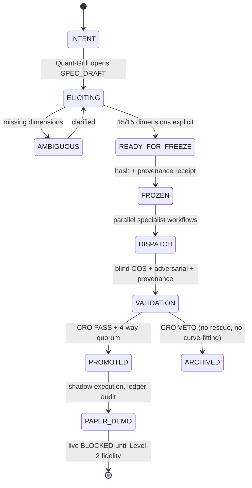
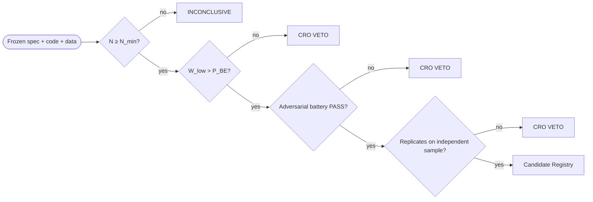

# Binary Options Quant Laboratory


An institutional-grade quantitative laboratory for researching, auditing and backtesting binary-option derivatives. This repository is not a trading bot — it is an **evidence laboratory designed to prove the absence or presence of statistical and economic edge** under extreme methodological rigor.

> **Current phase (see `STATE.md`): Commit 051** — `MODEL_H010` in `04_PAPER/DEMO` (paper shadow authorized, live blocked) · `H011` Phase-1 exploration protocol `[FROZEN]` · `DEMO_IQO_OPS v1.0.0` demo rails `[FROZEN]`.

---

## 1. Epistemology — The Quantitative Contract

| # | Principle | Formalization |
|---|-----------|---------------|
| 1 | Strict causality (no look-ahead) | `∀ d ∈ D, timestamp(d) ≤ t` — OOS state updates strictly sequentially; `t+1` never influences a decision at `t` |
| 2 | Economic break-even barrier | `P_BE = 1 / (1 + r)` — e.g. payout `0.85 → 54.05%`. A win rate below the barrier is negative expectancy (`EV < 0`), regardless of directional p-values |
| 3 | Estimand definition | `P_win = P(WIN \| resolved, non-PUSH)` — PUSH outcomes are excluded from the denominator and reported separately |
| 4 | Minimum sample | `N ≥ 30` before any conclusive verdict; powered designs use `N_min` from formal power analysis (e.g. H011: `N ≥ 450` for `Δ = 4.45pp`, `α = 0.05`, `1−β = 0.80`) |
| 5 | Statistical evidence gate | 95% Wilson Score lower bound must clear the barrier: `W_low > P_BE` (Wilson, never Wald) |
| 6 | Immutability (`[FROZEN] ≠ EDITABLE`) | Hypotheses are pre-declared and cryptographically hashed **before** any OOS data is consumed. Post-hoc tuning is forbidden — any change is a new version with a new hash and provenance entry |
| 7 | Signal ≠ instrument | The predictive signal and the payoff architecture are specified ex-ante and evaluated separately; the economic instrument cannot be chosen after observing results |
| 8 | No synthetic substitution | Absent empirical data never authorizes silent synthetic replacement (`sourceType = SYNTHETIC` pipelines are segregated and can never feed an official economic verdict) |

---

## 2. System Architecture



### 2.1 Multi-agent governance (separation of duties)

```text
                          EXECUTIVE BOARD / CEO  (mandates & capital)
                                  │
            ┌─────────────────────┴─────────────────────┐
            ▼                                           ▼
  CHIEF RISK OFFICER (CRO)                  CHIEF TECHNOLOGY OFFICER (CTO)
  sovereign VETO · Tri-Proof gate           architecture · determinism
            │                                           │
            ├───────────────┬───────────────┬───────────┤
            ▼               ▼               ▼           ▼
  EXPERIMENT CONTROLLER  CORE TECH   TRADING & EXECUTION  │
  lineage · run IDs      (engine,   (bridges,             │
  freeze gates            red-team)  reconciliation)      │
            │                                            │
    ┌───────┴───────┐                                     │
    ▼               ▼                                     │
 ALPHA RESEARCH   STATISTICAL VALIDATION ◄────────────────┘
 (hypotheses,      (blind OOS replay)
  features)
```

Golden rule: *agents may collaborate; frozen artifacts may not.* Research, engineering and validation see **only** In-Sample data; the OOS partition stays locked under the Experiment Controller until blind replay (Chinese Walls).

### 2.2 Research lifecycle (state machine)



Any "small tweak" after freezing is a **new version** (new hash, new provenance entry) — never an edit.

### 2.3 Validation gates (all must pass independently)



Apparent profitability alone never promotes: sample gate → Wilson gate → robustness gate (Mulberry32 null, label permutations, PUSH stress, boundary fuzzing) → replication gate → 4-way consensus (CRO, CTO, Experiment Controller, CEO).

---

## 3. Track Registry

| Track | State | Description |
|-------|-------|-------------|
| `MODEL_H010` (HYPOTHESIS_010) | `04_PAPER/DEMO` — paper AUTHORIZED, live BLOCKED | Macro-conditioned order-flow absorption on BTCUSDT/BINANCE_SPOT, 60s, payout 0.85. Blind OOS 153d: N=147, WR 62.59%, `W_low 54.54% > P_BE 54.05%` (+48 bps), 5/5 months profitable. Sole validated champion. Spec `SPEC_PAPER_H010 v1.1.0` |
| `H011` | `F1 [FROZEN]` — IS collection only | IQO-native XAUUSD 60s line, two-phase design: Phase 1 exploratory calibration on fresh 30d IS (CLOSED-only, dedup `from/id`, gaps >30min quarantined) → Phase 2 single frozen hypothesis → fresh blind OOS (`N ≥ 450`, `Δ = 4.45pp`). Practice-only, live BLOCKED |
| `DEMO_IQO_OPS v1.0.0` | `[FROZEN]` ops rails | IQO practice/demo scaffold: BTC/USD regular (OTC rejected), 60s, fixed 1.0U stake, 10U daily stop, >300s disconnect sticky freeze, observed-payout-only fills, signal DISABLED (zero trades out of the box). Outputs quarantined — zero evidence power |
| H001/H002/H004/H005/H007/H009 | `FALSIFIED & ARCHIVED` | Falsified with full post-mortems; no parameter rescue. H006 promoted then superseded in lineage by H010 |
| H008 | Abandoned pre-freeze | Draft never frozen; superseded by the clean H011 line |

---

## 4. Repository Structure

```text
.
├── .agents/                   # Orchestrator constitution, roster, rules, skills
├── artifacts/model_registry/  # Promoted model manifests (4-way quorum signatures)
├── research/
│   ├── datasets/              # Canonical datasets + SHA-256 manifests
│   ├── execution/             # Venue specs, discovery receipts, paper ledgers
│   ├── experiments/           # Experiment manifests (EXP_*)
│   ├── governance/            # Frozen specs, registries, provenance, risk decisions
│   ├── hypotheses/            # Pre-declared hypothesis documents
│   └── reports/               # OOS validation, adversarial audits, post-mortems
├── scripts/
│   ├── data_acquisition/      # Recorder, canonicalization, fidelity audit
│   ├── execution/             # Paper supervisors, shadow executors, demo-ops rails
│   └── research/              # Blind OOS replay harnesses
├── src/
│   ├── core/                  # Immutable primitives (Signal, MarketObservation, ...)
│   ├── data/                  # Loaders and structural validators
│   ├── execution/             # PaperExecutionBridge, TradeLedger (frozen, reused)
│   ├── replay/                # Causal replay engine (delayed resolution)
│   ├── research/              # Target/EV/calibration/metrics engines
│   ├── strategy/models/       # Frozen strategy implementations + reversed controls
│   └── validation/            # Walk-forward validators
└── tests/
    ├── adversarial/           # Red-team suites (null, permutation, fuzzing, leakage)
    ├── integration/           # Temporal/causal integration checks
    └── unit/                  # Unit + governance tests (73 suites / 268 tests)
```

---

## 5. Getting Started

### Prerequisites

- Node.js v18+
- Git
- Python 3.11+ (data-acquisition recorder only)

### Install

```bash
git clone https://github.com/microfactx/binary-options-quant.git
cd binary-options-quant
npm install
```

### Run the test suite

```bash
node node_modules/jest/bin/jest.js
```

> 268 tests across 73 suites. 13 failures are pre-existing and unrelated to active tracks (frozen-SHA drift in superseded registry manifests; canonical CSVs absent from the checkout) — documented in `DEMO_IQO_OPS_FENCE_RECEIPT_v1.0.0.json`. The active-track suites (`DemoIqoOps` 11/11, `PaperSupervisor_H010`, `PaperExecutionBridge`, `048_adversarial_h010`) are green.

### Operate the H010 paper shadow (authorized)

```js
const PaperSupervisorH010 = require('./scripts/execution/paper_supervisor_h010');
const sup = new PaperSupervisorH010(); // frozen bridgeConfig {250, 0.85, 1.0}, BINANCE_SPOT
sup.preWarm(canonicalM1Bars);          // gate: >=1440 bars + macro SMA, zero dispatch before
sup.processCandle(m1, micro5s);        // Predict BEFORE Update, 30d/100-settled enforcer
```

Live capital deployment is `BLOCKED` pending broker execution fidelity (latency <250ms, zero slippage proof) + new Tri-Proof + quorum.

---

## 6. Key Invariants (non-negotiable)

1. **Causality:** no feature, however derived, may use data timestamped after the decision point.
2. **Estimand:** `P_win = P(WIN | resolved, non-PUSH)` — PUSH never converts to WIN/LOSS.
3. **Break-even:** `W_low > 1/(1+r)` — the lower bound, not the point estimate, must clear the payout hurdle.
4. **Frozen mutation:** editing a `[FROZEN]` artifact without a new version + hash is a governance violation.
5. **OOS blindness:** no OOS window may be excluded/weighted on TRAIN metrics unless pre-registered.
6. **Fail-closed:** unverifiable hash, schema, registry state or lineage ⇒ `STATE = BLOCKED`, no fallback execution.

---

## 7. License & Disclaimer

Distributed under the MIT License.

**Strictly quantitative research software.** Nothing in this repository constitutes financial advice or investment recommendation. Past backtest results guarantee nothing about future performance — binary options carry intrinsically negative mathematical expectancy due to payout friction, which is precisely what this laboratory measures.
