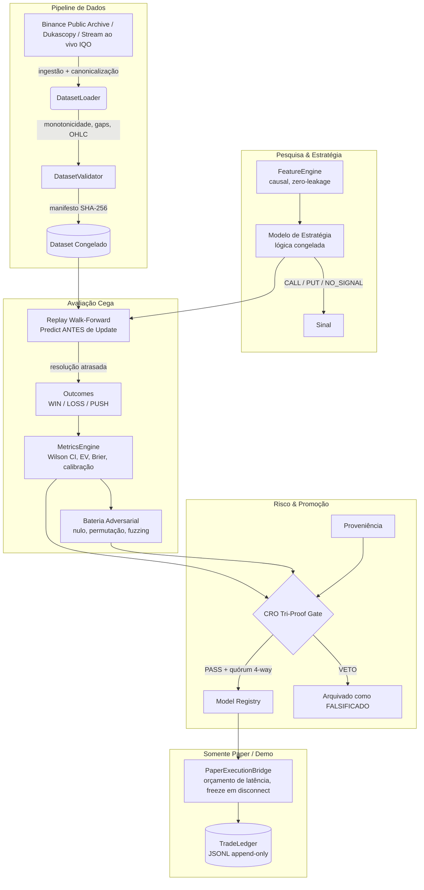
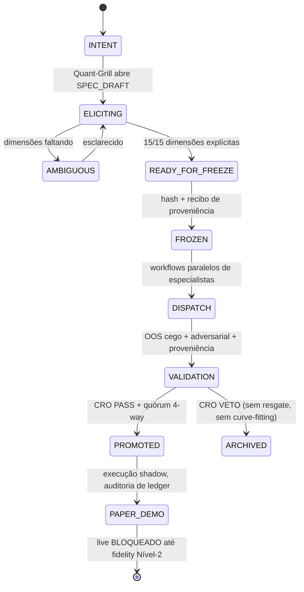
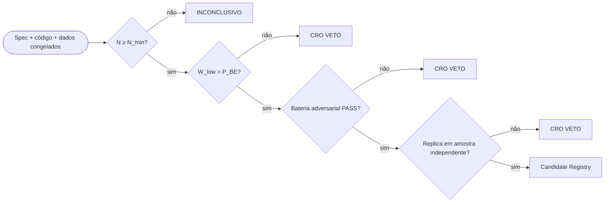

# Laboratório Quant de Opções Binárias


Um laboratório quantitativo de nível institucional para pesquisar, auditar e backtestar derivativos de opções binárias. Este repositório não é um robô de trade — é um **laboratório de evidências projetado para provar a ausência ou presença de edge estatístico e econômico** sob rigor metodológico extremo.

> **Fase atual (ver `STATE.md`): Commit 051** — `MODEL_H010` em `04_PAPER/DEMO` (paper shadow autorizado, live bloqueado) · `H011` protocolo de exploração Fase-1 `[FROZEN]` · `DEMO_IQO_OPS v1.0.0` trilhos demo `[FROZEN]`.

---

## 1. Epistemologia — O Contrato Quantitativo

| # | Princípio | Formalização |
|---|-----------|---------------|
| 1 | Causalidade estrita (sem look-ahead) | `∀ d ∈ D, timestamp(d) ≤ t` — o estado OOS (Out-of-Sample) avança de forma estritamente sequencial; `t+1` nunca influencia uma decisão em `t` |
| 2 | Barreira econômica de break-even | `P_BE = 1 / (1 + r)` — ex: payout `0,85 → 54,05%`. Win rate abaixo da barreira é expectancy negativa (`EV < 0`), independentemente de p-values direcionais |
| 3 | Definição do estimando | `P_win = P(WIN \| resolvido, non-PUSH)` — resultados PUSH ficam fora do denominador e são reportados separadamente |
| 4 | Amostra mínima | `N ≥ 30` antes de qualquer veredito conclusivo; desenhos com poder usam `N_min` de análise formal de poder (ex: H011: `N ≥ 450` para `Δ = 4,45pp`, `α = 0,05`, `1−β = 0,80`) |
| 5 | Gate de evidência estatística | O limite inferior do intervalo de Wilson de 95% precisa superar a barreira: `W_low > P_BE` (Wilson, nunca Wald) |
| 6 | Imutabilidade (`[FROZEN] ≠ EDITÁVEL`) | Hipóteses são pré-declaradas e seladas com hash criptográfico **antes** de qualquer dado OOS ser consumido. Tuning post-hoc é proibido — qualquer mudança é uma nova versão com novo hash e novo registro de proveniência |
| 7 | Sinal ≠ instrumento | O sinal preditivo e a arquitetura de payoff são especificados ex-ante e avaliados separadamente; o instrumento econômico não pode ser escolhido após observar resultados |
| 8 | Sem substituição sintética | Ausência de dado empírico nunca autoriza substituição sintética silenciosa (pipelines `sourceType = SYNTHETIC` são segregados e jamais alimentam um veredito econômico oficial) |

---

## 2. Arquitetura do Sistema



### 2.1 Governança multi-agente (separação de funções)

```text
                          DIRETORIA / CEO  (mandatos e capital)
                                  │
            ┌─────────────────────┴─────────────────────┐
            ▼                                           ▼
  CHIEF RISK OFFICER (CRO)                  CHIEF TECHNOLOGY OFFICER (CTO)
  VETO soberano · Tri-Proof gate            arquitetura · determinismo
            │                                           │
            ├───────────────┬───────────────┬───────────┤
            ▼               ▼               ▼           ▼
  EXPERIMENT CONTROLLER  CORE TECH   TRADING & EXECUÇÃO  │
  linhagem · run IDs     (engine,   (bridges,             │
  freeze gates            red-team)  reconciliação)       │
            │                                            │
    ┌───────┴───────┐                                     │
    ▼               ▼                                     │
 PESQUISA ALFA    VALIDAÇÃO ESTATÍSTICA ◄────────────────┘
 (hipóteses,       (replay OOS cego)
  features)
```

Regra de ouro: *agentes podem colaborar; artefatos congelados, não.* Pesquisa, engenharia e validação enxergam **somente** dados In-Sample; a partição OOS fica trancada sob o Experiment Controller até o replay cego (Chinese Walls).

### 2.2 Ciclo de vida da pesquisa (máquina de estados)



Qualquer "pequeno ajuste" após congelar é uma **nova versão** (novo hash, nova proveniência) — nunca uma edição.

### 2.3 Gates de validação (todos precisam passar de forma independente)



Lucratividade aparente sozinha nunca promove: gate amostral → gate Wilson → gate robustez (nulo Mulberry32, permutações de label, estresse PUSH, fuzzing de fronteira) → gate replicação → consenso 4-way (CRO, CTO, Experiment Controller, CEO).

---

## 3. Registro de Trilhas

| Trilha | Estado | Descrição |
|--------|--------|-----------|
| `MODEL_H010` (HYPOTHESIS_010) | `04_PAPER/DEMO` — paper AUTORIZADO, live BLOQUEADO | Absorção de fluxo macro-condicionada em BTCUSDT/BINANCE_SPOT, 60s, payout 0,85. OOS cego 153d: N=147, WR 62,59%, `W_low 54,54% > P_BE 54,05%` (+48 bps), 5/5 meses no verde. Único campeão validado. Spec `SPEC_PAPER_H010 v1.1.0` |
| `H011` | `F1 [FROZEN]` — somente coleta IS | Linha XAUUSD nativa da IQO, desenho em duas fases: Fase 1 calibração exploratória em IS fresco de 30d (somente CLOSED, dedup `from/id`, gaps >30min quarentenados) → Fase 2 única hipótese congelada → OOS fresco e cego (`N ≥ 450`, `Δ = 4,45pp`). Só Practice, live BLOQUEADO |
| `DEMO_IQO_OPS v1.0.0` | Trilhos ops `[FROZEN]` | Scaffold demo/practice IQO: BTC/USD regular (OTC rejeitado), 60s, stake fixo 1,0U, stop diário 10U, freeze sticky em disconnect/gap >300s, fills só com payout observado, sinal DISABLED (zero trades out of the box). Saídas quarentenadas — poder de evidência zero |
| H001/H002/H004/H005/H007/H009 | `FALSIFICADAS & ARQUIVADAS` | Falsificadas com post-mortem completo; sem resgate de parâmetro. H006 foi promovida e depois superada na linhagem pela H010 |
| H008 | Abandonada pré-freeze | Draft nunca congelado; superada pela linha limpa H011 |

---

## 4. Estrutura do Repositório

```text
.
├── .agents/                   # Constituição do orquestrador, roster, regras, skills
├── artifacts/model_registry/  # Manifestos de modelos promovidos (assinaturas do quórum 4-way)
├── research/
│   ├── datasets/              # Datasets canônicos + manifestos SHA-256
│   ├── execution/             # Specs de venue, recibos de discovery, ledgers paper
│   ├── experiments/           # Manifestos de experimentos (EXP_*)
│   ├── governance/            # Specs congeladas, registros, proveniência, decisões de risco
│   ├── hypotheses/            # Hipóteses pré-declaradas
│   └── reports/               # Validação OOS, auditorias adversariais, post-mortems
├── scripts/
│   ├── data_acquisition/      # Recorder, canonicalização, auditoria de fidelity
│   ├── execution/             # Supervisores paper, executores shadow, trilhos demo-ops
│   └── research/              # Harnesses de replay OOS cego
├── src/
│   ├── core/                  # Primitivas imutáveis (Signal, MarketObservation, ...)
│   ├── data/                  # Loaders e validadores estruturais
│   ├── execution/             # PaperExecutionBridge, TradeLedger (congelados, reutilizados)
│   ├── replay/                # Motor causal de replay (delayed resolution)
│   ├── research/              # Motores de target/EV/calibração/métricas
│   ├── strategy/models/       # Implementações congeladas + controles reversos
│   └── validation/            # Validadores walk-forward
└── tests/
    ├── adversarial/           # Suítes red-team (nulo, permutação, fuzzing, leakage)
    ├── integration/           # Checagens temporais/causais de integração
    └── unit/                  # Testes unitários + governança (73 suítes / 268 testes)
```

---

## 5. Começando

### Pré-requisitos

- Node.js v18+
- Git
- Python 3.11+ (somente para o recorder de aquisição de dados)

### Instalação

```bash
git clone https://github.com/microfactx/binary-options-quant.git
cd binary-options-quant
npm install
```

### Rodando a suíte de testes

```bash
node node_modules/jest/bin/jest.js
```

> 268 testes em 73 suítes. 13 falhas são pré-existentes e alheias às trilhas ativas (drift de SHA congelado em manifestos de registry superados; CSVs canônicos ausentes no checkout) — documentadas em `DEMO_IQO_OPS_FENCE_RECEIPT_v1.0.0.json`. As suítes das trilhas ativas (`DemoIqoOps` 11/11, `PaperSupervisor_H010`, `PaperExecutionBridge`, `048_adversarial_h010`) estão verdes.

### Operando o paper shadow H010 (autorizado)

```js
const PaperSupervisorH010 = require('./scripts/execution/paper_supervisor_h010');
const sup = new PaperSupervisorH010(); // bridgeConfig congelado {250, 0.85, 1.0}, BINANCE_SPOT
sup.preWarm(canonicalM1Bars);          // gate: >=1440 barras + SMA macro, zero dispatch antes
sup.processCandle(m1, micro5s);        // Predict ANTES de Update, enforcer 30d/100 settled
```

Deploy live com capital real está `BLOQUEADO` até fidelity de execução do broker (latência <250ms, prova de slippage zero) + novo Tri-Proof + quórum.

---

## 6. Invariantes-Chave (inegociáveis)

1. **Causalidade:** nenhuma feature, por mais derivada que seja, pode usar dado com timestamp posterior ao ponto de decisão.
2. **Estimando:** `P_win = P(WIN | resolvido, non-PUSH)` — PUSH nunca vira WIN/LOSS.
3. **Break-even:** `W_low > 1/(1+r)` — o limite inferior, não a estimativa pontual, precisa superar o hurdle do payout.
4. **Mutação de congelado:** editar artefato `[FROZEN]` sem nova versão + hash é violação de governança.
5. **Cegueira OOS:** nenhuma janela OOS pode ser excluída/ponderada por métrica TRAIN salvo se pré-registrado.
6. **Fail-closed:** hash, schema, estado de registry ou linhagem inverificável ⇒ `STATE = BLOCKED`, sem execução alternativa.

---

## 7. Licença & Aviso Legal

Distribuído sob licença MIT.

**Software estritamente de pesquisa quantitativa.** Nada neste repositório constitui conselho financeiro ou recomendação de investimento. Resultados passados de backtest não garantem nada sobre performance futura — opções binárias carregam expectancy matemática intrinsecamente negativa por causa da fricção do payout, que é precisamente o que este laboratório mede.
